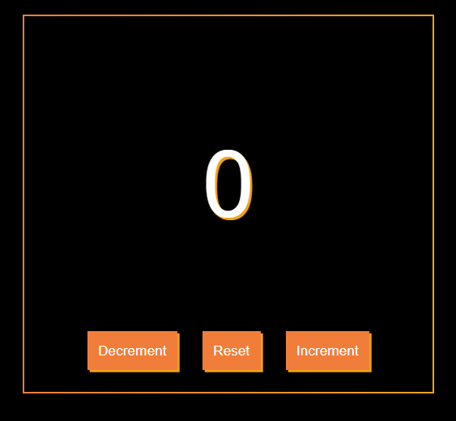

# ClickCounter

ClickCounter is a simple, counter application built with HTML, CSS, and JavaScript.

  

## Description

ClickCounter is designed to be a user-friendly counter application. With its minimalist design and intuitive interface, it allows users to increment, decrement, or reset the count with just a click of a button.

## Features

- **Increment Button**: Increases the count by one each time it's clicked.
- **Decrement Button**: Decreases the count by one each time it's clicked.
- **Reset Button**: Resets the count back to zero.

## Installation

1. Clone this repository: `git clone https://github.com/rohanvron/ClickCounter.git`
2. Open the `index.html` file in your web browser.

## Technologies Used

- HTML
- CSS
- JavaScript

## Contributing

Pull requests are welcome. For major changes, please open an issue first to discuss what you would like to change.

if you’re looking to enhance it, here are a few suggestions:

**Functionality Enhancements:**

1. **Count by Custom Increments:** Allow the user to set a custom increment/decrement value.
2. **Save/Load Counts:** Implement a feature to save the current count and load it later.
2. **Multiple Counters:** Allow users to manage multiple counters at once.

**UI/UX Improvements:**

1. **Themes:** Implement different color themes or a dark/light mode switch.
2. **Animations:** Add subtle animations for button clicks or count changes.
3. **Responsive Design:** Ensure your application is responsive and looks good on all device sizes.

## License

This project is licensed under the MIT License. See the `LICENSE` file for more details.

Check Out the <a href="https://rohanvron.github.io/ClickCounter/"> DEMO </a>
